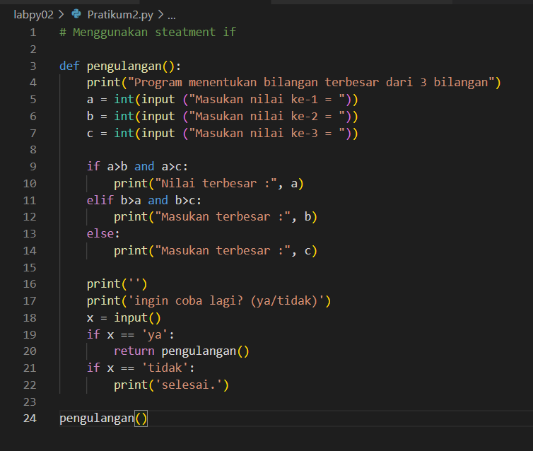

#Pratikum4

# Labpys02(Pratikum2)
# Flowchart menentukan bilangan terbesar dari 3 buah bilangan

# Algoritma
 1. Start 
 2. Masukan nilai a,b,c
 3. Melakukan proses untuk menentukan bilangan mana yang memiliki bilangan terbesar dengan steatment if
 4. Melakukan pencetakan hasil proses
 5. End

# Program menentukan bilangan terbesar dari 3 buah bilangan 

 - kode programnya:

 - hasil dari kode programnya:

# Algoritma Mengurutkan bilagan dari urutan terkecil
 1. Input banyaknya suatu bilagan pada variabel a
 2. Deklarasi variabel bil dengan array berindeks kosong
 3. Buat perulangan for untuk menginput nilai atau index pada variabel bil, gunakan variabel x untuk menginputkan nilai nya
 4. Gunakan perintah bil.append(x) yang berfungsi untuk memasukkan nilai pada variabel x ke dalam index bil
 5. Gunakan perintah list.sort(bil) utnuk mengurutkan bilangan

 - kode programnya:

 - hasil dari kode programnya:
 

# Labpy03

# Latihan 1 ( bilangan random)

# Flowchart latihan 1

# Algoritma Latihan 1
  1. Start 
  2. Masukan fungsi random terlebih dahulu 
  3. Deklarasi integer
  4. memasukan nilai jumlah N
  5. Mencetak data ke 1 sampai 5 dengan hasil nilai kurang dari 0,5
  6. End
  
# Program Latihan 1

 - kode programnya:

- hasil dari kode programnya:

# Algoritma Latihan 1 (nested)

 1. Membuat perulangan nested yakni perulangan dalam perulangan, menggunakan perulangan fo
 2. Buat perulangan for pertama dan kedua dengan range(10)
 3. Didalam perulangan tersebut terdapat variabel di sini saya menggunakan variabel i dan b,
 4. Gunakan statment if untuk mengatur jarak spasi antar perulangannya supaya terlihat rapi dan membentuk pola persegi, dengan cara:

 - Jika i + b lebih kecil dari 10 maka jarak hanya dua spasi, tetapi = Jika i + b lebih kecil dari 20 maka jarak hanya satu spasi.

 5. lalu print menggunakan end=jarak itu adalah perintah print yang berfungsi membuat perulangan ke samping dan di ikuti juga selanjutnya dengan perintah print()
 
 - kode programnya:
 

 - hasil dari kode programnya:
 

# Algoritma Latihan 2 (mencari nilai terbesar)
 
 1. Mendeklarasikan variabel a sebagai array berindex kosong
 2. Membuat perulangan menggunakan while, perulangan akan terus berlanjut selagi bilangan atau index yang di input tidak sama dengan 0 (!=) dan perulangan akan berhenti jika bilangan atau index yang di inputkan sama dengan 0
 3. Membuat variabel d untuk menampung index dalam array variabel a
 4. Gunakan perintah variabel_index.append(variabel_penginput) untuk memasukkan nilai yang di inputkan kedalam index array variabel a
 5. Gunakan perintah max() untuk mencari nilai terbesarnya

 - kode programnya:

 - hasil dari kode programnya:

# Program 1 (Pratikum3)
 Seorang pengusaha menginvestasikan uangnya untuk memulai usahanya dengan modal awal 100 juta, pada bulan pertama dan kedua belum mendapatkan laba. pada bulan ketiga baru mulai mendapatkan laba sebesar 1% dan pada bulan ke 5, pendapatan meningkat 5%, selanjutnya pada bulan ke 8 mengalami penurunan keuntungan sebesar 2%, sehingga laba menjadi 3%. Hitung total keuntungan selama 8 bulan berjalan usahanya.

# Algoritma program 1
 
 1. Mendeklarasikan varibel : Modal = 100000000 Laba ke-1 sampai 2 = modal x 0 Laba ke-3 sampai 4 = modal x 0.01 Laba ke-5 sampai 7 = modal x 0.05 Laba ke-8 = modal x 0.03
 2. Mendeklarasikan varibel total untuk menambilkan total hasil dari seluruh laba 1 sampai 8 Total = laba ke-1 sampai 2 + laba ke-3 sampai 4 + laba ke-5 sampai 7 + laba ke-8
 3. Membuat perulangan menggunakan for untuk menambilkan hasil Laba 1 sampai 8

 - kode programnya:

 - hasil dari kode programnya:
